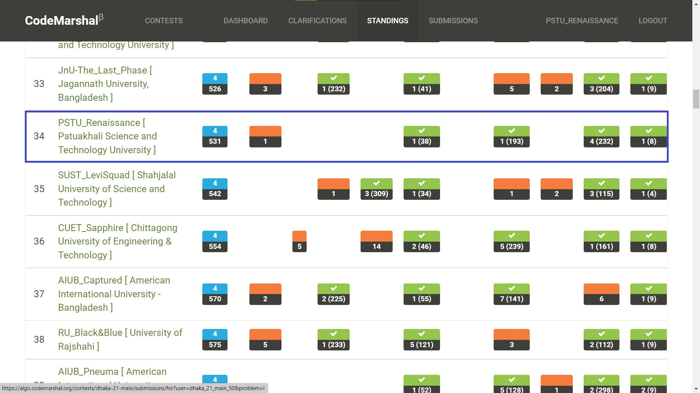
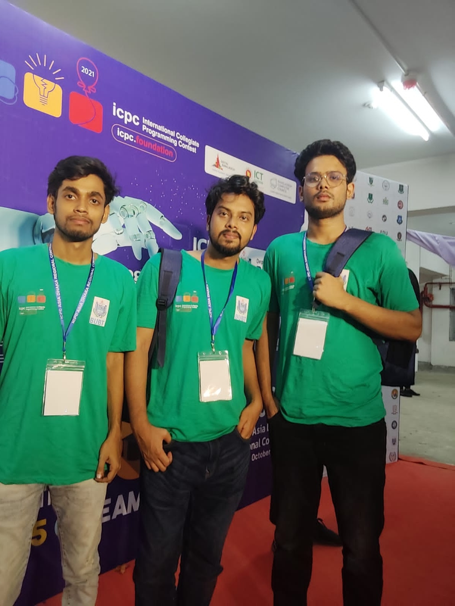

# ICPC Dhaka Regional Final 2021

### Contest Overview
In 2021, our team participated in the [**ICPC Dhaka Regional Final**](https://algo.codemarshal.org/contests/dhaka-21-main), a prestigious event in the competitive programming landscape for South Asia. Organized on the CodeMarshal platform, the contest brought together talented teams from universities across the region, all competing for top rankings and a chance to advance to the ICPC World Finals.

### Our Achievement
Our team ranked **34th** among highly competitive participants, marking a significant achievement as we represented our university at this level. Despite the intense competition, we demonstrated strong problem-solving skills, teamwork, and resilience.

### Proof of Participation
While the CodeMarshal website (where the contest was hosted) is currently offline, we have included the following materials as proof of our participation and ranking:
- **Ranking Screenshot**: 
- **Team Photo**: 

### Personal Reflection
Participating in the ICPC Dhaka Regional was both challenging and rewarding. It tested our skills under pressure and allowed us to learn from some of the best minds in the region. We look forward to building on this experience in future contests and continually improving our competitive programming skills.

---

Thank you for viewing our ICPC journey!
